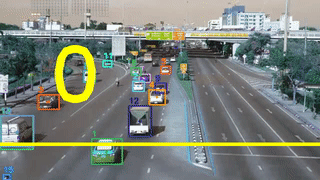
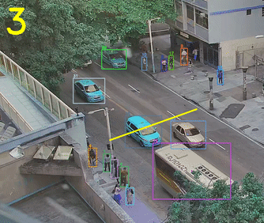

# tensorflow-yolov4-tflite
[](LICENSE)

YOLOv4 Implemented in Tensorflow 2.0. 
Convert YOLO v4, YOLOv3, YOLO tiny .weights to .pb, .tflite and trt format for tensorflow, tensorflow lite, tensorRT.

Download yolov4.weights file: https://drive.google.com/open?id=1cewMfusmPjYWbrnuJRuKhPMwRe_b9PaT


### Disclaimer
This github is still in working. Not so much have been done yet, 
The purpose is to create a vehicle and people counter and make it appliable for deploy.


### Prerequisites
```bash
pip install -r requirements.txt
pip install -r requirements-gpu.txt
```
But instead of doing it on your own computer, every step on this repository will be placed in a google-colab notebook. 


### Demo

```bash
# yolov4
python detect.py --weights ./data/yolov4.weights --framework tf --size 608 --image ./data/kite.jpg

# yolov4 tflite
python detect.py --weights ./data/yolov4-int8.tflite --framework tflite --size 416 --image ./data/kite.jpg

# yolov4 video - with file output
python detectvideo_output.py --weights ./data/yolov4.weights --framework tf --size 608 --video ./path_to_video_file

# yolov4 counter - need to change the line position within the file.
python detectvideo_counter.py --weights ./data/yolov4.weights --framework tf --size 608 --video ./path_to_video_file
```

#### Outputs






### Obtain a dataset for a custom or class focused train
Some times, if you want to increase your detection speed or add some class to your detection, you should
retrain your network. 
I prepared a colab-notebook with dataset download to acquire OpenImages with proper labels for darknet.
[Colab Notebook for Dataset Download](https://colab.research.google.com/drive/1SUtyP_YyYrMPtcTIFJpduZyjwEQ5nBVJ?usp=sharing)


### Traning your own model

The training performance is not fully reproduced yet, so I recommended to use Alex's [Darknet](https://github.com/AlexeyAB/darknet) to train your own data, then convert the .weights to tensorflow or tflite.


### Convert to tflite

```bash
# yolov4
python convert_tflite.py --weights ./data/yolov4.weights --output ./data/yolov4.tflite

# yolov4 quantize float16
python convert_tflite.py --weights ./data/yolov4.weights --output ./data/yolov4-fp16.tflite --quantize_mode float16

# yolov4 quantize int8
python convert_tflite.py --weights ./data/yolov4.weights --output ./data/yolov4-fp16.tflite --quantize_mode full_int8 --dataset ./coco_dataset/coco/val207.txt
```
### Convert to TensorRT
```bash
# yolov3
python save_model.py --weights ./data/yolov3.weights --output ./checkpoints/yolov3.tf --input_size 416 --model yolov3
python convert_trt.py --weights ./checkpoints/yolov3.tf --quantize_mode float16 --output ./checkpoints/yolov3-trt-fp16-416

# yolov3-tiny
python save_model.py --weights ./data/yolov3-tiny.weights --output ./checkpoints/yolov3-tiny.tf --input_size 416 --tiny
python convert_trt.py --weights ./checkpoints/yolov3-tiny.tf --quantize_mode float16 --output ./checkpoints/yolov3-tiny-trt-fp16-416

# yolov4
python save_model.py --weights ./data/yolov4.weights --output ./checkpoints/yolov4.tf --input_size 416 --model yolov4
python convert_trt.py --weights ./checkpoints/yolov4.tf --quantize_mode float16 --output ./checkpoints/yolov4-trt-fp16-416
```


### References

  This project is totally based on the following implementations and Ideas
  They are amazing!
  
  * [darknet](https://github.com/AlexeyAB/darknet)
  * [hunglc007-tfyolov4lite]https://github.com/hunglc007/tensorflow-yolov4-tflite
  * [TheAIGuy](https://github.com/theAIGuysCode)
  * [Object counter in Yolo](https://github.com/tugot17/YOLO-Object-Counting-API)
